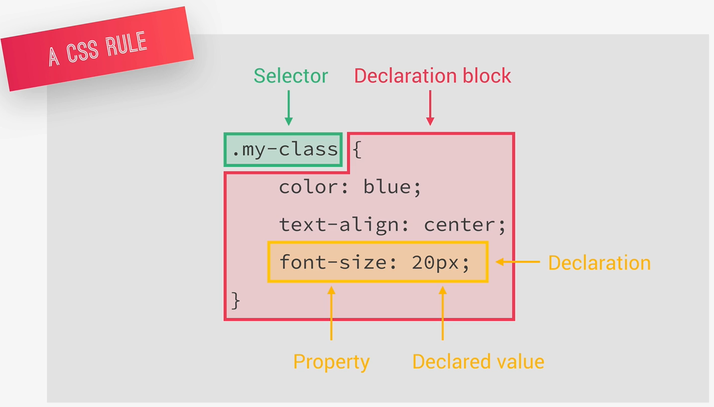
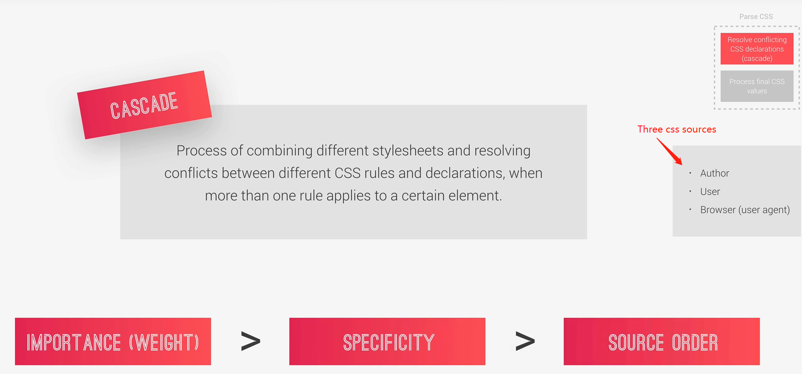
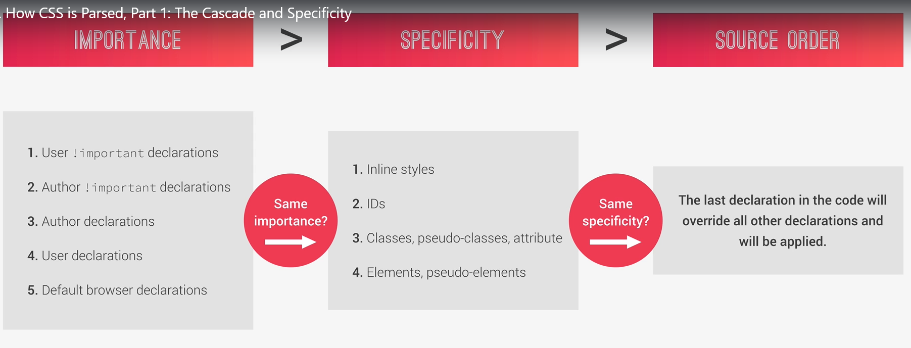

# Natours Project Note

## What you will learn in this lecture

- The best way to perform a basic reset using the universal selector.

- How to set project-wide font definitions.

- How to clip parts of elements using clip-path

```css
clip-path: polygon(0 0, 100% 0, 100% 75vh, 0 100%);
```

## Three Pillars of Writing Good HTML and CSS (Never Forget Them!)

### Responsive design

- Fluid layouts
- Media queries
- Responsive images
- Correct units
- Desktop-first vs Mobile-first

### Maintainable and scalable code

- Clean
- Easy-to-understand
- Growth for future
- Reusable
- How to organize files
- How to name classes
- How to structure HTML

### Web performance

- Less HTTP requests
- Less code
- Compress code
- Use a CSS preprocesser
- Less images
- Compress images

## How CSS Works?

### What happens to CSS when we load up a webpage?

1. Load HTML
2. Parse HTML line by line -> DOM
3. When parse HTML, in the meantime, Load CSS and parse CSS -> CSSOM
4. Parse CSS Phase:
   - Resolve conflicting CSS delcarations(cascade)
   - Process final CSS values
5. plus DOM and CSSOM to Render tree
6. Website rendering: the visiual formatting model
7. Final rendered website

### CSS Parse Phase

#### A CSS rule



#### The Cascade





- CSS declarations marked with `!important` have the highest priority
- But, only use `!important` as a last resource. It's better to use correct specificities: **more maintainable code**
- Inline styles will always have priority over styles in external stylesheets.
- A selector that contains `1` ID is more specific than one with `1000` classes.
- A selector that contains `1` class is more specific than one with `1000` elements.
- The universal selector `*` has no specificity value `(0, 0, 0, 0)`
- Rely more on `specificity` than on the `order` of selectors
- But, rely on order when using 3rd-party stylesheets: always put your author stylesheet last.
